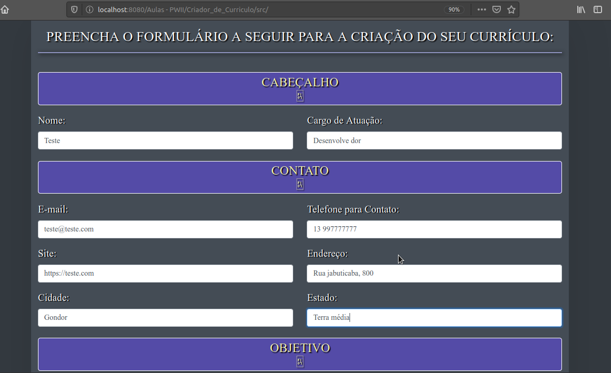
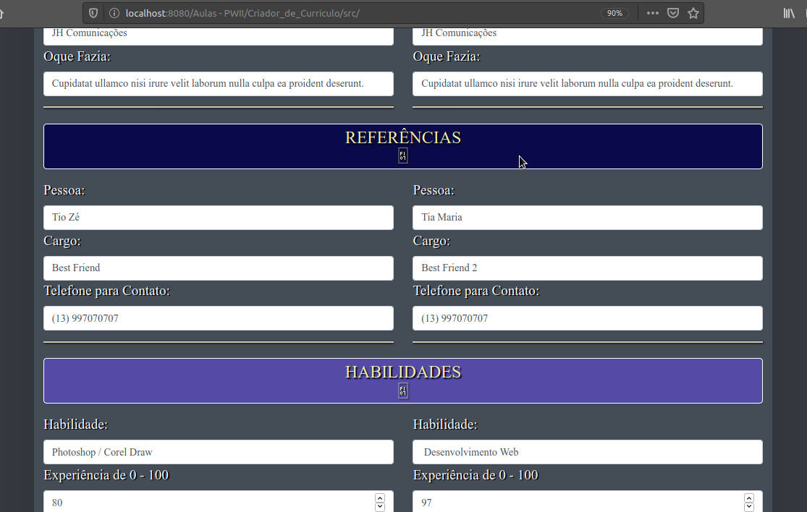

Criador de Currículo
===================

##### Página feita em PHP, que cria seu currículo com dados informados.
### Como usar:

Na página inicial, irá ser mostrado um formulário com diversos campos para ser preenchido com seus dados: _nome, contato, endereço, experiências, etc._

Logo após ser preenchido, ao clicar no botão, seu cúrriculo irá ser gerado de acordo com o nosso layout. A página irá ser redirecionada, onde mostrará em tela o currículo pronto.

> Tela de inicial com o formulário.

> Preenchimento do formulário

     
    

> Currículo Pronto!...

